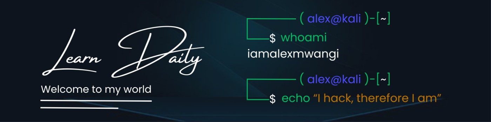

## Below are some resources that were beneficial to me on my certification adventure.
  
- Pracrice. Practice. Practice.

  

| Name                                        | Description                              | Links                                            |
|-------------------------------------------------------|------------------------------------------|-----------------------------------------------------|
| AWS re/Start notes                    | Google drive with all AWS re/Start notes                | [AWS re/Start notes](https://drive.google.com/drive/folders/1pmouoY__6UDWhaeqVS7ApF2rbbnh1XPh?usp=sharing) |
| AWS Cloud Practitioner Essentials.                    | AWS Skills Builder course                | [AWS Cloud Practitioner Essentials](https://explore.skillbuilder.aws/learn/course/external/view/elearning/134/aws-cloud-practitioner-essentials)   |
| Youtube playlist with exam dumps | Real exam questions| [AWS Certified Cloud Practitioner Practice Exams](https://www.youtube.com/playlist?list=PL7GozF-qZ4KeQftuqU3yxvQ-f3eFNUiuJ) |
| AWS boy Revision Questions                            | Revision questions for practice          | [AWS Cloud Practitioner Revision Questions](https://www.awsboy.com/) |

## Exam mocks

- [chapter 1](https://github.com/scriptkiddieke/aws-certified/blob/main/Mock%20exams/exam1.md) 
- [chapter 2](https://github.com/scriptkiddieke/aws-certified/blob/main/Mock%20exams/exam2.md) 
- [chapter 3](https://github.com/scriptkiddieke/aws-certified/blob/main/Mock%20exams/exam3.md) 
- [chapter 4](https://github.com/scriptkiddieke/aws-certified/blob/main/Mock%20exams/exam4.md) 
- [chapter 5](https://github.com/scriptkiddieke/aws-certified/blob/main/Mock%20exams/exam5.md)  
